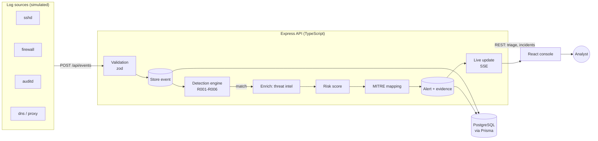
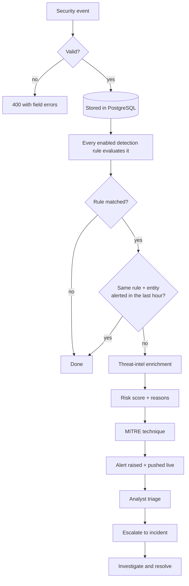
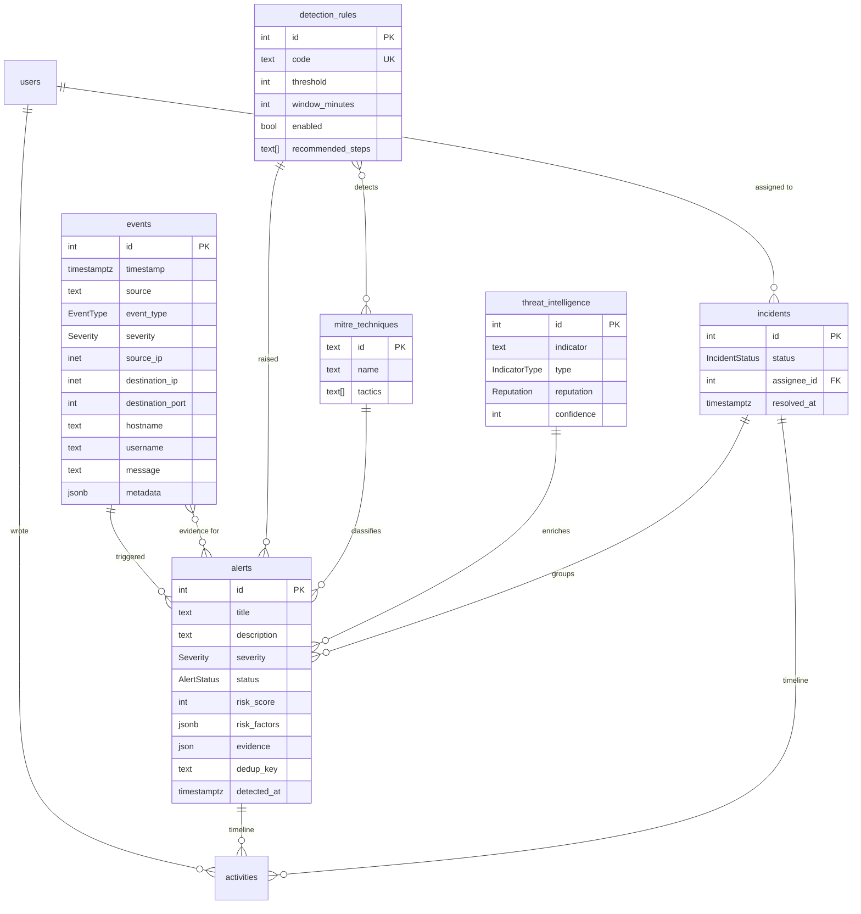

# MiniSOC

**Lightweight Security Operations Center Platform**

Event monitoring · Detection engineering · Alert investigation · Incident response · Threat intelligence · MITRE ATT&CK

MiniSOC ingests security events, runs them through a deterministic detection engine, and turns matches into alerts that explain themselves: why the rule fired, how the risk score was calculated, which MITRE ATT&CK technique it maps to, and what threat intelligence knows about the attacker. Analysts triage alerts, escalate them into incidents and work those incidents to resolution, all from a real-time web console.

It is deliberately small: one React app, one Express API, one PostgreSQL database. Every part is meant to be read, understood and explained.

---

## Contents

1. [Why I built it](#why-i-built-it)
2. [Architecture](#architecture)
3. [Technology stack](#technology-stack)
4. [Database design](#database-design)
5. [Detection engine](#detection-engine)
6. [Risk scoring](#risk-scoring)
7. [MITRE ATT&CK integration](#mitre-attck-integration)
8. [Threat intelligence](#threat-intelligence)
9. [Authentication and security](#authentication-and-security)
10. [Running it locally](#running-it-locally)
11. [Demo credentials and a 5-minute demo](#demo-credentials-and-a-5-minute-demo)
12. [API overview](#api-overview)
13. [Real-time updates](#real-time-updates)
14. [Optional AI analyst](#optional-ai-analyst)
15. [Testing](#testing)
16. [Project structure](#project-structure)
17. [Design decisions and trade-offs](#design-decisions-and-trade-offs)
18. [Screenshots](#screenshots)
19. [Future improvements](#future-improvements)

---

## Why I built it

A Security Operations Center turns a flood of raw logs into a few decisions a human can act on. I wanted to understand that pipeline end to end by building it: how a correlation rule decides that five failed logins are an attack but four are not, how an alert should explain itself so an analyst can trust it, and how detections map onto an adversary framework like MITRE ATT&CK.

The first version was a Flask + SQLite prototype. This version (v2) rebuilds it as a typed full-stack application on the stack most teams use today, keeping the security concepts and dropping everything that wasn't pulling its weight.

## Architecture



**The core SOC workflow**, exactly as the code runs it (`server/src/services/eventService.ts` → `server/src/detection/engine.ts`):



Layers inside the API are kept flat and predictable:

```
route (URL + auth/role middleware) → controller (parse input, send response) → service (logic + Prisma) → PostgreSQL
```

## Technology stack

| Layer | Choice | Why |
|---|---|---|
| Frontend | React 19, TypeScript, Vite | Component model, fast dev server, no framework lock-in |
| Styling | Tailwind CSS 4 | Design tokens in one CSS file, no custom CSS framework to maintain |
| Charts | Recharts | Declarative React charts; used for the time series and the severity donut |
| Routing | React Router 7 | Standard client-side routing; filters live in the URL so views are shareable |
| State | React state, hooks and two small contexts | Server data is fetched per page; no global store needed |
| Backend | Node.js 22, Express 5, TypeScript | Express 5 forwards async errors, so one central error handler covers every route |
| ORM | Prisma 7 (with the `pg` driver adapter) | Type-safe queries, versioned migrations, parameterised SQL |
| Database | PostgreSQL 18 | `inet`, `jsonb`, `timestamptz`, arrays, CHECK constraints and `date_bin()` for charts |
| Validation | zod | Validates every request and gives typed input for free |
| Auth | bcrypt + JWT in an httpOnly cookie | Standard, stateless, and no token is ever exposed to JavaScript |
| Security | helmet, cors, express-rate-limit | Secure headers, an origin allow-list, and brute-force protection on login |
| Tests | Vitest, Supertest, Testing Library | One test runner for both apps; API tests hit a real PostgreSQL test database |
| Dev database | Docker Compose (PostgreSQL only) | One command for a local database; the apps run directly with Node |

Deliberately **not** used: Redis, Kafka, Elasticsearch, GraphQL, Redux, microservices, Kubernetes. None of them solves a problem this project has.

## Database design

Eight tables. The first seven are the core SOC entities; `activities` exists because notes and timelines need an author and a timestamp per entry, and it doubles as an audit trail.



PostgreSQL-specific choices worth knowing:

- **`inet`** for IP addresses: the database itself rejects `999.1.1.1`.
- **`timestamptz`** everywhere, so time-zone bugs cannot creep into charts or rule windows.
- **CHECK constraints** (added by hand to the first migration, since Prisma's schema language can't express them): ports are 0-65535, confidence and risk scores are 0-100, and every activity belongs to an alert or an incident.
- **Composite indexes** match the detection look-ups, e.g. `(source_ip, event_type, timestamp)` for "failed logins from this IP in the last 5 minutes".
- **`jsonb`** for free-form event metadata (queryable), but plain **`json`** for alert evidence, because JSONB reorders keys and the evidence is shown to analysts in the order the rule wrote it.

## Detection engine

Every event posted to `POST /api/events` is stored and then evaluated by every enabled rule. Rules are ordinary TypeScript modules in `server/src/detection/rules/`, each implementing one interface:

```ts
interface DetectionRuleDefinition {
  code: string;                       // "R001"
  severity: Severity;
  mitreTechniqueIds: string[];        // first one is the alert's primary technique
  defaults: { threshold, windowMinutes };
  eventTypes: EventType[];            // cheap pre-filter
  recommendedSteps: string[];         // playbook shown on the alert page
  evaluate(event, settings): Promise<RuleMatch | null>;
}
```

| Rule | Detects | Condition (defaults) | Severity | MITRE |
|---|---|---|---|---|
| **R001** SSH Brute Force | Password guessing | ≥ 5 failed SSH logins from one IP within 5 min | HIGH | T1110 |
| **R002** Network Port Scan | Service discovery | One IP hits ≥ 10 distinct ports within 3 min | HIGH | T1046, T1595 |
| **R003** Suspicious Login | Stolen credentials | First login from an IP unseen for this account in 30 days (with ≥ 3 earlier logins), or from an IP with a bad reputation | MEDIUM | T1078, T1133 |
| **R004** Privilege Escalation | Root abuse | A non-privileged user runs `sudo su`, a root shell, sudoers/SUID changes, admin-group changes or reads `/etc/shadow` | CRITICAL | T1548 (T1003, T1098 per command) |
| **R005** Brute Force → Successful Login | Account compromise | A successful login from an IP with ≥ 3 failures in the previous 10 min | CRITICAL | T1110, T1078 |
| **R006** Threat Intelligence Match | C2 / malware | Outbound connection, DNS lookup or download matching a MALICIOUS indicator (≥ 70 % confidence) | HIGH | T1071, T1105 |

How the engine behaves:

- **Deterministic.** The same events always produce the same alerts. No AI, no randomness.
- **Tunable without a deploy.** Code defines the logic; the `detection_rules` table holds each rule's `enabled` flag, threshold and window, which an admin can change from the Settings page. The server syncs rule definitions into the table on startup, without overwriting tuning.
- **Suppression.** One alert per rule and entity per hour, so a 10-minute brute force produces one alert, not a hundred.
- **Event time, not processing time.** An alert's `detectedAt` is the timestamp of the event that completed the pattern, so replaying historical logs (as the seed script does) produces the same timeline as live ingestion.
- **Evidence is stored with the alert.** The events that satisfied the rule (e.g. all five failed logins) are linked to the alert, alongside the measured facts (`failedAttempts: 7, threshold: 5, windowMinutes: 5, targetedAccounts: [...]`).
- **Fault isolation.** A failing rule is logged and skipped; it cannot block ingestion or the other rules.

**Adding a rule** is two steps: create `server/src/detection/rules/myRule.ts` implementing the interface, then add it to the list in `rules/index.ts`. Restart the server and it appears in the database, in Settings and on the MITRE page.

## Risk scoring

Severity says how bad a type of detection is; the risk score (0-100) says how urgent this particular alert is. It is a pure function (`server/src/detection/riskScore.ts`) and every point is recorded, so the UI can show exactly why an alert scored what it did.

| Component | Points |
|---|---|
| Base score by severity | LOW 20 · MEDIUM 40 · HIGH 70 · CRITICAL 90 |
| Repeated activity: the source IP already raised an alert in the last 24 h | +10 |
| Known malicious indicator: threat intelligence marks the IP or IOC as MALICIOUS | +10 |
| Privileged account involved (`root`, `admin`, ...) | +10 |
| Cap | max 100 (a negative "capped" line keeps the breakdown adding up) |

| Score | Risk level |
|---|---|
| 0-30 | Low |
| 31-60 | Medium |
| 61-80 | High |
| 81-100 | Critical |

Example breakdown stored on an alert:

```json
[
  { "label": "Base score for CRITICAL severity", "points": 90 },
  { "label": "Repeated activity: this source already triggered alerts in the last 24 hours", "points": 10 },
  { "label": "Known malicious indicator: 203.0.113.45", "points": 10 },
  { "label": "Capped at the maximum of 100", "points": -10 }
]
```

The dashboard's **overall risk** is the average risk score of all alerts that are still open.

## MITRE ATT&CK integration

MiniSOC ships a focused local subset of **15 techniques** that matter for what it monitors (authentication, network, process, DNS and download telemetry), with tactics, descriptions and links to attack.mitre.org. It is not the full framework and doesn't pretend to be.

- Each rule maps to one or more techniques (a many-to-many table). Each alert records its primary technique, and some rules pick a more specific one per match (R004 maps reading `/etc/shadow` to T1003 and group changes to T1098).
- The MITRE page groups techniques by tactic in kill-chain order and shows, for each: the rules that detect it, how many alerts it produced (linking to the filtered alert list) and **coverage gaps**, i.e. techniques no enabled rule detects yet. Gaps are how detection engineers decide what to build next.

## Threat intelligence

A local database of indicators: **IP addresses, domains and SHA-256 file hashes**, each with a reputation (MALICIOUS / SUSPICIOUS / BENIGN), a confidence (0-100), a source, and first/last-seen dates.

- **Enrichment:** when an alert is raised, the source IP is looked up. A match is linked to the alert and shown on the investigation page, and a MALICIOUS match adds +10 risk. BENIGN entries help too: the internal vulnerability scanner is listed as BENIGN, which is how an analyst recognises its port-scan alerts as false positives.
- **Detection:** rule R006 fires when an internal host contacts a malicious IP, resolves a malicious domain or downloads a file with a known-malware hash.
- **No external feeds yet.** Data is seeded locally. Because indicators are stored in a feed-agnostic table (normalised to lowercase, unique per type), adding an importer for AbuseIPDB, MISP or OTX later means writing rows, not changing detection code.

All demo IPs come from the RFC 5737 documentation ranges and all domains use the reserved `.example` TLD, so no real host is ever implicated.

## Authentication and security

Security practices are part of the design, not an afterthought:

| Practice | Where |
|---|---|
| Passwords hashed with **bcrypt** (cost 12), never stored or logged in plain text | `services/authService.ts` |
| Session = signed **JWT in an httpOnly, SameSite=Strict cookie** (`Secure` in production). JavaScript can never read it; cross-site requests never carry it | `middleware/auth.ts` |
| JWT algorithm pinned to HS256 (blocks `alg: none` and algorithm-confusion tokens); the user is re-loaded from the database on every request, so role changes and deletions apply immediately | `services/authService.ts` |
| **Generic login errors** and a constant-time dummy hash, so responses don't reveal which emails exist | `services/authService.ts` |
| **Rate limiting**: 10 failed logins per IP per 15 min; caps on ingestion and on the AI assistant | `middleware/rateLimit.ts` |
| **Role-based authorisation**: ADMIN (everything, including rule tuning), ANALYST (triage, incidents, ingestion, intel), VIEWER (read-only), enforced by middleware on every route and mirrored in the UI | `middleware/auth.ts`, `routes/*` |
| **Input validation** with zod on every body, query string and route parameter; invalid input gets a 400 with field-level errors | `schemas/*` |
| **Parameterised SQL**: all queries go through Prisma; the few raw queries use tagged templates, which Prisma parameterises | `db.ts`, `dashboardService.ts` |
| **Secure headers** via helmet (CSP, no-sniff, frame protection); `X-Powered-By` removed | `app.ts` |
| **CORS allow-list** from configuration; in production the API serves the UI itself, so everything is same-origin | `app.ts`, `config.ts` |
| **Safe errors**: one central handler returns `{ success: false, message }`; stack traces are logged, never sent | `middleware/errorHandler.ts` |
| **Secrets from the environment**, validated at startup (the server refuses to start with a short JWT secret, or with the example secret in production) | `config.ts` |
| **CSV formula-injection protection**: usernames and log messages are attacker-controlled, so exported cells starting with `=`, `+`, `-` or `@` are neutralised | `utils/csv.ts` |
| **Audit trail**: every status change, assignment and note is an `activities` row with its author | `activities` table |
| **Test-database guard**: the test suite refuses to run against a database whose name doesn't end in `_test` | `server/tests/testDatabase.ts` |

## Running it locally

**Requirements:** Node.js 22.12+, and either Docker (for PostgreSQL) or a local PostgreSQL 14+ install.

```bash
git clone https://github.com/viditshah1727/MiniSOC.git
cd MiniSOC
npm install                              # installs both apps (npm workspaces)

cp server/.env.example server/.env       # PowerShell: Copy-Item server/.env.example server/.env
docker compose up -d                     # starts PostgreSQL on localhost:5432

npm run db:deploy                        # apply database migrations
npm run db:seed                          # 7 days of realistic demo data (~20 s)
npm run dev                              # API on :4000, web app on :5173
```

Open **http://localhost:5173** and sign in with a demo account (below).

The defaults in `.env.example` work for local development. For anything else, set `JWT_SECRET` to a long random value:

```bash
node -e "console.log(require('crypto').randomBytes(48).toString('base64url'))"
```

Other useful commands:

| Command | What it does |
|---|---|
| `npm test` | Run all server and client tests (the server tests create and migrate a `minisoc_test` database automatically) |
| `npm run typecheck` | Type-check both apps |
| `npm run build` | Production build of both apps |
| `npm start` | Run the built API, which also serves the built UI on :4000 |
| `npm run simulate -- <scenario>` | Send a simulated attack to the running API, like a log shipper would |
| `npm run db:seed` | Reset the database to fresh demo data (**deletes existing data**) |
| `npm run db:migrate` | Create a new migration after changing `schema.prisma` (development) |

Using your own PostgreSQL instead of Docker: create a database and point `DATABASE_URL` in `server/.env` at it.

## Demo credentials and a 5-minute demo

The seed script creates four accounts. Their password is the `SEED_DEMO_PASSWORD` value in `server/.env` (default: `MiniSOC-demo-2026`). Demo only: change it for anything that isn't your laptop.

| Role | Email | Can |
|---|---|---|
| Admin | `admin@minisoc.local` | Everything, including enabling and tuning detection rules |
| Analyst | `analyst@minisoc.local` | Triage alerts, run incidents, ingest events, add threat intel |
| Analyst | `sam.rivera@minisoc.local` | Same as above (a second analyst for assignments) |
| Viewer | `viewer@minisoc.local` | Read-only |

**What the seed contains.** About 1,000 events over the last 7 days (logins, DNS, firewall, process and download telemetry) and eight attack campaigns, all run through the real detection engine: a mass scanner, credential stuffing, an authorised vulnerability scan (a false positive), a slow brute force, a login from a residential proxy, a **full intrusion kill chain** (scan → brute force → login → root shell → C2 → payload), an admin-group change and an EICAR test download. A week of analyst work is replayed on top: triage notes, false positives, and resolved, closed and ongoing incidents.

**A demo script for an interview:**

1. **Dashboard.** The overall risk, the activity chart and the top source IPs. `203.0.113.45` stands out as MALICIOUS.
2. **Alerts → the open CRITICAL "Successful login after brute force: jsmith".** Walk through *why it fired* (9 failures, then a success), the *risk breakdown* (90 + repeated + malicious IP, capped at 100), MITRE T1110, the threat-intel record and the timeline.
3. **Create incident** from it, assign it and add a note. Then open the related R004 alert (jsmith read `/etc/shadow`) and discuss escalation.
4. **Simulate attack → Full intrusion (kill chain)** from the top bar. Watch the toasts arrive live as R002, R001, R005, R003, R004 and R006 fire.
5. **Settings.** As admin, lower R001's threshold, or disable a rule and show it stop firing.
6. **MITRE ATT&CK.** Coverage: which techniques are detected and which are gaps.

## API overview

All responses share one shape: `{ "success": true, "data": ..., "pagination"? }` or `{ "success": false, "message": "...", "errors"?: [...] }`.

| Method | Path | Access | Purpose |
|---|---|---|---|
| POST | `/api/auth/login` | public, rate-limited | Sign in (sets the session cookie) |
| POST | `/api/auth/logout` | any | Sign out |
| GET | `/api/auth/me` | signed in | Current user and enabled features |
| GET | `/api/health` | public | Liveness + database check |
| POST | `/api/events` | analyst+ | Ingest an event; runs detection; returns the alerts it raised |
| GET | `/api/events` | signed in | List with filters: `severity`, `eventType`, `sourceIp`, `from`, `to`, `q`, `page`, `pageSize` |
| GET | `/api/events/:id` | signed in | One event and the alerts it is evidence for |
| GET | `/api/alerts` | signed in | List with filters: `status`, `severity`, `ruleCode`, `mitreTechniqueId`, `sourceIp`, `q`, `sort=recent\|risk` |
| GET | `/api/alerts/:id` | signed in | Full investigation view: evidence, risk factors, rule, MITRE, intel, timeline, related alerts |
| PATCH | `/api/alerts/:id` | analyst+ | `{ status?, note? }`: investigate, resolve, false positive, reopen |
| POST | `/api/alerts/:id/ai-analysis` | analyst+ | Optional AI explanation (read-only) |
| GET | `/api/incidents` | signed in | List with filters: `status`, `severity`, `assigneeId`, `q` |
| GET | `/api/incidents/:id` | signed in | Incident with linked alerts, evidence events and timeline |
| POST | `/api/incidents` | analyst+ | Escalate `{ alertIds, title?, severity?, assigneeId? }` (one transaction) |
| PATCH | `/api/incidents/:id` | analyst+ | `{ status?, assigneeId? }`; resolving an incident resolves its alerts |
| POST | `/api/incidents/:id/notes` | analyst+ | Add a note to the timeline |
| GET | `/api/threat-intelligence` | signed in | List with filters: `type`, `reputation`, `q` |
| POST | `/api/threat-intelligence` | analyst+ | Add an indicator (format validated per type) |
| GET | `/api/mitre/techniques` | signed in | Techniques with rules, alert counts and coverage |
| GET | `/api/rules` | signed in | Detection rules with tunable settings and alert counts |
| PATCH | `/api/rules/:id` | admin | `{ enabled?, threshold?, windowMinutes? }` |
| GET | `/api/dashboard/stats?range=24h\|7d` | signed in | KPIs, chart series and recent activity in one call |
| GET | `/api/reports/{alerts,events,incidents}.csv` | signed in | CSV exports (same filters as the lists) |
| GET | `/api/users` | signed in | The team (for assignment) |
| GET | `/api/stream` | signed in | Server-Sent Events stream of live updates |
| GET / POST | `/api/simulate[/scenarios]` | analyst+ | Demo attack simulator (only when `ENABLE_SIMULATION=true`) |

Ingesting an event from the command line:

```bash
curl -c cookies.txt -H "Content-Type: application/json" \
  -d '{"email":"analyst@minisoc.local","password":"MiniSOC-demo-2026"}' \
  http://localhost:4000/api/auth/login

curl -b cookies.txt -H "Content-Type: application/json" http://localhost:4000/api/events -d '{
  "source": "sshd", "eventType": "AUTH_FAILURE", "severity": "LOW",
  "sourceIp": "203.0.113.9", "destinationIp": "10.0.1.10", "destinationPort": 22,
  "hostname": "web-01", "username": "root",
  "message": "Failed password for root from 203.0.113.9 port 51514 ssh2"
}'
```

Event types: `AUTH_SUCCESS`, `AUTH_FAILURE`, `NETWORK_CONNECTION`, `PROCESS_EXECUTION`, `DNS_QUERY`, `FILE_DOWNLOAD`. Rules read a few conventional `metadata` keys: `command` (process execution), `domain` (DNS/proxy), `sha256` and `fileName` (downloads).

## Real-time updates

The browser keeps one **Server-Sent Events** connection (`GET /api/stream`). When an alert is raised or changes, or an incident is opened or updated, the API pushes a small message; open pages refresh themselves (bursts are coalesced into one reload) and serious alerts pop a toast.

Why SSE rather than WebSockets: updates only flow server → browser, SSE is plain HTTP (the session cookie and auth middleware just work), browsers reconnect automatically, and it needs no library. The broadcaster is an in-process `EventEmitter`, which is right for one server; running several instances would need a shared channel such as PostgreSQL `LISTEN/NOTIFY`.

## Optional AI analyst

The SOC works fully without AI: detection, scoring and triage are deterministic. If `ANTHROPIC_API_KEY` is set on the server, the alert page shows **Analyze with AI**, which sends that alert (rule, evidence, intel, events) to Claude and displays a summary, the likely attacker behaviour, a MITRE rationale and suggested next steps.

Guardrails:

- **Advisory only.** The response is displayed, never stored, and nothing in the code path can change an alert, a severity or an incident.
- **Prompt-injection aware.** Alert data is sent inside `<alert>` tags and declared untrusted, since usernames, commands and log lines can be written by an attacker.
- **Structured output.** The response must match a zod schema (validated by the SDK), so the UI never renders free-form model text as instructions.
- **Access and cost control.** Analysts and admins only, rate-limited, with clear 503/429/502 responses when unconfigured, busy or failing.
- **Refusal fallback.** Server-side fallback (`fallbacks: "default"`) retries a declined request on Anthropic's recommended fallback model.

## Testing

```bash
npm test          # server + client
```

| Suite | What it covers |
|---|---|
| **Server** (Vitest + Supertest, real PostgreSQL) | Every detection rule's trigger, near-misses and suppression; risk-scoring maths; privileged-command patterns; auth (cookies, forged/`alg: none` tokens, rate limiting, deleted users); role enforcement; event validation and filters; alert triage; incident workflow and transactions; dashboard numbers; reports and CSV injection; simulator; the live SSE stream over a real socket; the AI assistant with a mocked SDK |
| **Client** (Vitest + Testing Library) | API client error handling; alert table rendering; the investigation page (explanation, actions, false-positive justification, viewer read-only, AI panel); dashboard KPIs, charts, table view and range filter; the login flow; timeline burst folding |

Each server test starts from a clean database (truncate + reference data), so tests are independent and deterministic. GitHub Actions (`.github/workflows/ci.yml`) runs the typecheck, both test suites and the build on every push, with PostgreSQL as a service container.

## Project structure

```
MiniSOC/
├── client/                       React + TypeScript + Vite
│   └── src/
│       ├── api/                  typed fetch client + every endpoint
│       ├── components/           layout, ui kit, charts, alerts, events, incidents, timeline
│       ├── context/              auth, toasts, live updates (SSE)
│       ├── hooks/                useApi, useUrlFilters
│       ├── pages/                one file per route
│       ├── types/                API response types
│       └── utils/                formatting and labels
├── server/                       Express + TypeScript + Prisma
│   ├── prisma/
│   │   ├── schema.prisma         the data model
│   │   ├── migrations/           versioned SQL (incl. CHECK constraints)
│   │   └── seed/                 demo data: timeline, threat intel, analyst work
│   ├── scripts/simulate.ts       CLI "log shipper" for demos
│   ├── src/
│   │   ├── routes/               URL → middleware → controller
│   │   ├── controllers/          parse input, send response
│   │   ├── services/             business logic and database access
│   │   ├── detection/            engine, rules R001-R006, risk score, MITRE data
│   │   ├── middleware/           auth, rate limits, error handler
│   │   ├── schemas/              zod request schemas
│   │   ├── simulation/           demo attack generators (demo only)
│   │   ├── utils/                errors, CSV, logger, live updates
│   │   ├── app.ts                builds the Express app (used by tests)
│   │   └── index.ts              starts the server
│   └── tests/                    API and unit tests
├── docker-compose.yml            PostgreSQL for local development
└── package.json                  npm workspaces: one install, one dev command
```

## Design decisions and trade-offs

| Decision | Why | Trade-off / what would change at scale |
|---|---|---|
| Detection runs synchronously inside `POST /api/events` | Simplest correct design: the response tells the sender which alerts fired | Ingestion latency grows with rule count; at high volume use a queue and background workers |
| Rule logic in code, rule settings in the database | Logic is testable and reviewable; tuning needs no deploy | New rules need a deploy (acceptable; importing Sigma rules would be the next step) |
| Event-time alerts (`detectedAt` = event timestamp) | Replaying history gives the same results as live processing | Late-arriving logs create alerts "in the past", which is the correct behaviour |
| One alert per rule and entity per hour | Prevents alert fatigue | A long attack isn't re-alerted; the alert's related-activity views show the continuation |
| Integer IDs | Readable references (`ALR-21`, `INC-4`) | All SOC data is shared by role, so sequential IDs don't expose anything a user can't already see |
| JWT in an httpOnly cookie | Stateless, no session store, no token in JavaScript | A token can't be revoked before it expires (8 h); the per-request user lookup limits the impact |
| SSE with an in-process emitter | No broker, no extra library | Single server only; use PostgreSQL `LISTEN/NOTIFY` or Redis pub/sub for several |
| `activities` table for notes and timelines | Real rows with author, time and type; doubles as an audit trail | One more table than the minimum |

## Screenshots

Captured at 1440×900 after `npm run db:seed`, signed in as the analyst. Files live in `docs/screenshots/`.

| | |
|---|---|
|  |  |
|  |  |

## Future improvements

- **Real log collection:** an `auth.log`/syslog parser and a Windows Event Log forwarder, API keys for machine ingestion, and a batch ingestion endpoint.
- **Sigma rule import**, so detections can be shared with other tools.
- **Threat-intel feed importers** (AbuseIPDB, MISP, OTX) on a schedule.
- **Alert aggregation:** attach new evidence to an existing alert instead of suppressing it.
- **Scaling:** a job queue for detection, PostgreSQL `LISTEN/NOTIFY` for live updates, a shared rate-limit store.
- **Identity:** SSO (OIDC), MFA, and an admin audit log for rule changes (currently written to the server log).
- **End-to-end browser tests** (Playwright) on top of the API and component tests.
