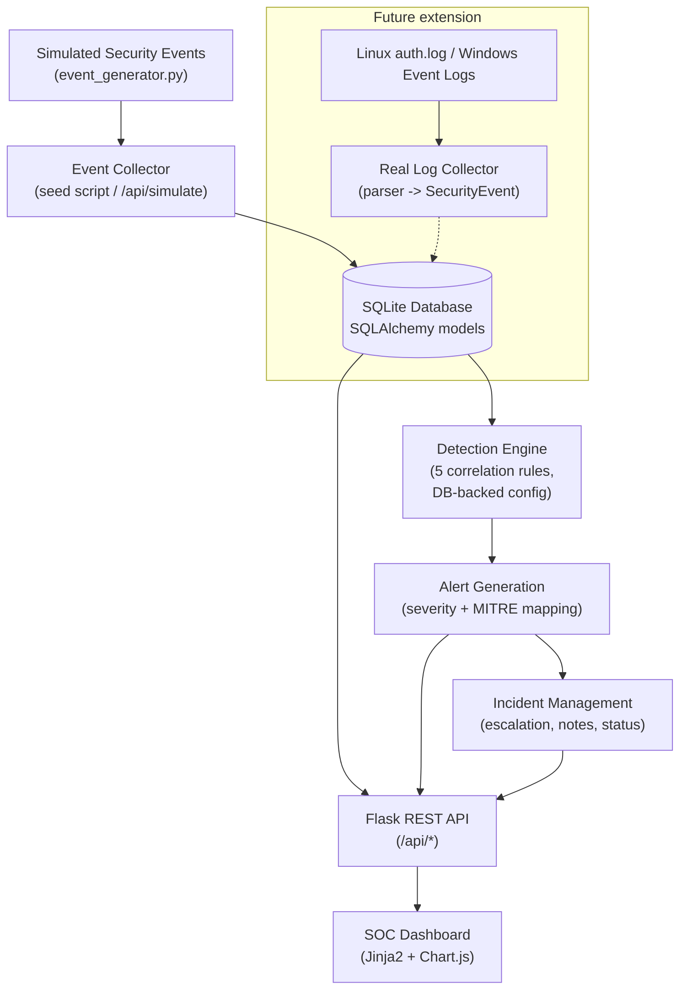

# MiniSOC — Security Operations Center Monitoring & Incident Detection Platform

A self-contained, web-based SOC dashboard built with **Python / Flask / SQLite /
Chart.js**. It ingests security events, runs them through a rule-based
**detection engine**, raises **alerts** mapped to **MITRE ATT&CK** techniques,
and supports the full analyst workflow: triage → investigation → notes →
incident → containment → resolution.

> **Version 1 runs entirely on simulated demo data.** Every event is generated
> locally from realistic attack patterns (private-range IPs only); nothing on
> the dashboard is hand-planted — all alerts are produced by the detection
> engine, and all metrics are queried live from the database. Real Linux/Windows
> log ingestion is a planned extension (see [Future Improvements](#future-improvements)).

---

## Overview

MiniSOC gives a SOC analyst a single pane of glass to:

- Monitor security events (SSH auth, port scans, web attacks, privilege
  escalation, malware indicators) with search, filters, and pagination
- Watch KPIs and visual trends (event timeline, severity mix, top attacker IPs,
  attack categories)
- Triage alerts raised by a correlation-based detection engine
- Investigate: raw logs, related events/alerts by source IP, local threat
  intelligence, MITRE ATT&CK context, and a per-rule investigation playbook
- Escalate alerts into incidents, assign analysts, track status through
  OPEN → INVESTIGATING → CONTAINED → RESOLVED → CLOSED
- Export a CSV security report

## Problem Statement

Small teams and students rarely have access to a full SIEM/SOAR stack, yet the
core SOC workflow — *telemetry → detection → alert → investigation → incident* —
is exactly what a SOC analyst must be able to explain and operate. MiniSOC
implements that whole pipeline end-to-end at a scale that is fully inspectable:
every rule, query, and alert can be read and explained in an interview.

## Objectives

1. Build a working end-to-end detection pipeline, not a static mockup
2. Keep every detection rule explainable (thresholds, windows, MITRE mapping)
3. Model a realistic analyst workflow (statuses, notes, escalation)
4. Architect for real log ingestion later without rework
5. Follow secure coding practices throughout

## Features

| Area | Details |
|---|---|
| Dashboard | 6 KPI cards, event timeline (1h/6h/24h/7d), severity donut, top source IPs, attack categories, recent critical alerts & incidents |
| Alerts | Search + filter (severity, status, source IP, date), full investigation page with raw log, related events/alerts, MITRE mapping, playbook, notes, status workflow, escalate-to-incident |
| Incidents | Full lifecycle management, analyst assignment, linked alerts, notes |
| Events | 8 event types, search + 8 filters, pagination, raw-log detail modal |
| Detection | 5 database-backed rules (enable/disable at runtime from Settings) |
| Threat Intel | Local IP-reputation table (schema mirrors external feeds for later integration) |
| MITRE ATT&CK | Local technique reference with live detection counts per technique |
| Reports | Live summary + CSV export |
| Simulation | "Generate Security Event" button → weighted random scenario → detection run; optional 10 s auto-refresh polling |
| Security | Session auth with hashed passwords, CSRF protection, input validation, parameterised queries, secrets via `.env` |

## Architecture



The seam for real ingestion is the `SecurityEvent` model: any collector that
parses a log line into that schema (the simulator already emits
`auth.log`-style raw logs) feeds the identical detection path — the engine
never cares where events came from.

## Technology Stack

- **Backend:** Python 3, Flask 3 (app factory + blueprints), SQLAlchemy 2 / Flask-SQLAlchemy, SQLite
- **Frontend:** Jinja2 templates, vanilla JavaScript, Chart.js 4 (vendored locally), custom dark-theme CSS
- **Config/Secrets:** python-dotenv (`.env`)
- **Testing:** pytest (32 tests)

## Detection Rules

| Rule | Name | Trigger | Severity | MITRE |
|---|---|---|---|---|
| R001 | SSH Brute Force | ≥ 5 failed SSH logins from one source IP within 5 min | HIGH | T1110 |
| R002 | Successful Login After Brute Force | Successful SSH login preceded by ≥ 3 failures from the same IP within 10 min | CRITICAL | T1110 / T1078 |
| R003 | Port Scan Detected | One source IP probes ≥ 10 distinct ports within 3 min | MEDIUM | T1046 |
| R004 | Suspicious Login | Successful login from a bad-reputation IP (escalates to HIGH if MALICIOUS) or at unusual hours (00:00–05:00 UTC) | MEDIUM/HIGH | T1078 |
| R005 | Privilege Escalation Indicator | Suspicious sudo/root activity (root shell, sudoers edit, repeated sudo failures) | HIGH | T1548 |

Rules live in the `detection_rules` table (threshold, window, severity, MITRE
mapping, enabled flag); the matching logic in
[app/detection_engine.py](app/detection_engine.py) is looked up by rule code.
The engine processes each unprocessed event chronologically, queries back over
the event history within the rule's window (like a SIEM correlation search),
deduplicates one alert per (rule, source IP, window), and marks events
processed so re-runs are idempotent.

## MITRE ATT&CK Mappings

Local reference data for the techniques the rules detect (not an official or
complete ATT&CK implementation): **T1110** Brute Force, **T1078** Valid
Accounts, **T1046** Network Service Discovery, **T1548** Abuse Elevation
Control Mechanism, plus T1190/T1105 context for web-attack and malware event
categories. The MITRE page shows live per-technique detection counts from the
alerts table.

## Database Design

```
users            — dashboard analysts (PBKDF2-hashed passwords)
security_events  — raw telemetry; `processed` flag for the engine
detection_rules  — rule metadata + tunable parameters (DB-backed, toggleable)
alerts           — FK -> security_events, detection_rules, incidents
incidents        — escalated investigations; analyst, status lifecycle
analyst_notes    — FK -> alerts OR incidents
threat_intel     — local IP reputation (schema mirrors external feeds)
```

Flow: `SecurityEvent --(rule match)--> Alert --(analyst escalation)--> Incident`,
with `AnalystNote` attachable to both.

## Screenshots

*(placeholder — add screenshots of the dashboard, alert investigation page, and
incident page here)*

## Installation

```bash
git clone <your-repo-url> MiniSOC && cd MiniSOC   # or copy the project folder
python3 -m venv venv
source venv/bin/activate
pip install -r requirements.txt

cp .env.example .env
# generate a session key and paste it into .env as SECRET_KEY:
python3 -c "import secrets; print(secrets.token_hex(32))"

python scripts/seed_database.py     # creates data/minisoc.db + demo dataset
```

## Running the Application

```bash
source venv/bin/activate
python run.py
```

Open **http://127.0.0.1:5000** and log in as **`analyst`** with the password
from `DEFAULT_ANALYST_PASSWORD` in your `.env` (default `ChangeMe_123!` —
change it before showing anyone).

## Testing

```bash
./venv/bin/python -m pytest tests/ -v
```

32 tests cover the models, every detection rule (positive, negative, and
dedup/idempotency cases), authentication, CSRF enforcement, input validation,
alert/incident workflow APIs, filtering/pagination, simulation, and reports.

## Sample Attack Scenarios

The seeded dataset contains ~440 events over 7 days, including six coherent
campaigns (all private-range, fictional IPs):

- **192.168.1.105** — recon port scan, brute-force bursts, then a successful
  `admin` login (fires R001 **HIGH** and R002 **CRITICAL**), followed by
  privilege escalation
- **192.168.1.212** — repeated brute force that never succeeds
- **172.16.34.101** — recurring port scans across common service ports
- **10.0.99.66** — web attacks (SQLi, traversal, XSS) + C2-style malware
  indicators + a successful brute force
- **192.168.1.77** — port scan followed by an off-hours service-account login

Replay the flagship scenario live any time:

```bash
./venv/bin/python scripts/run_demo_scenario.py
```

It injects the brute-force burst with fresh timestamps, shows R001 firing, adds
the successful login, shows R002 firing CRITICAL, escalates to an incident,
adds notes, and resolves it — then everything is visible at the top of the
dashboard.

## Security Considerations

- **Authentication:** session-based login; passwords stored as salted PBKDF2
  hashes (werkzeug); sessions rotated on login; uniform login error message
- **CSRF:** all state-changing requests require a session-bound token
  (constant-time compared), sent via form field or `X-CSRF-Token` header
- **Injection:** all queries go through SQLAlchemy's parameterised ORM; the
  frontend HTML-escapes all API data before rendering
- **Input validation:** enum whitelists for severity/status, length caps,
  integer clamping on pagination, safe redirect validation on login
- **Secrets:** everything via `.env` (git-ignored); no hardcoded keys or
  passwords; ephemeral fallback key if unset
- **Cookies:** `HttpOnly`, `SameSite=Lax` (add `Secure` behind HTTPS)
- **Errors:** JSON for API / friendly page for UI; internals logged server-side
  only; debug mode off by default
- Defensive-only scope: the project monitors and detects; it contains no
  offensive tooling

## Future Improvements

1. **Real log ingestion** — a collector daemon parsing `/var/log/auth.log`
   (and Windows Event Log via agent) into `SecurityEvent` rows
2. External threat-intel enrichment (AbuseIPDB / OTX) upserting into the
   existing `threat_intel` table
3. WebSocket/SSE push instead of polling
4. Role-based access control (analyst / lead / read-only)
5. Alert assignment, SLA timers, and shift-handover views
6. Sigma-style rule definitions loaded from YAML
7. PDF report generation; email notifications for CRITICAL alerts
8. PostgreSQL + Docker Compose for multi-user deployments

## Resume Description

> Built **MiniSOC**, a full-stack Security Operations Center platform (Python/
> Flask/SQLite/Chart.js) featuring a correlation-based detection engine with 5
> MITRE ATT&CK-mapped rules (SSH brute force, post-brute-force compromise, port
> scanning, suspicious logins, privilege escalation), end-to-end alert triage
> and incident-response workflow, local threat intelligence, and CSV reporting —
> secured with hashed authentication, CSRF protection, and parameterised
> queries, and verified by a 32-test pytest suite.
