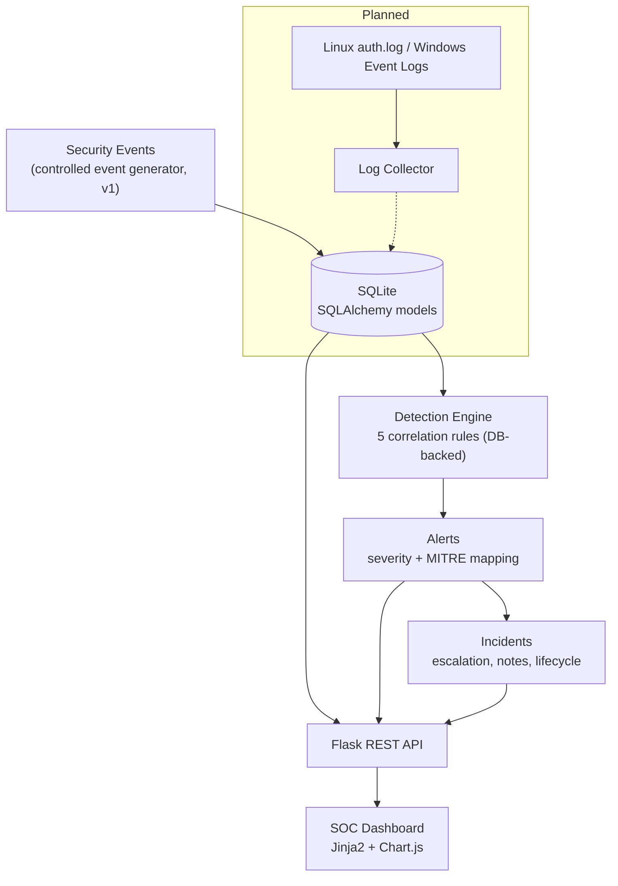
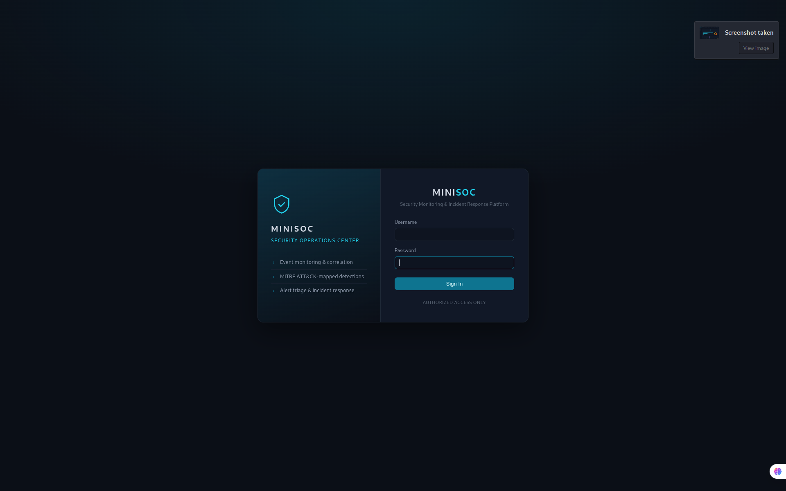
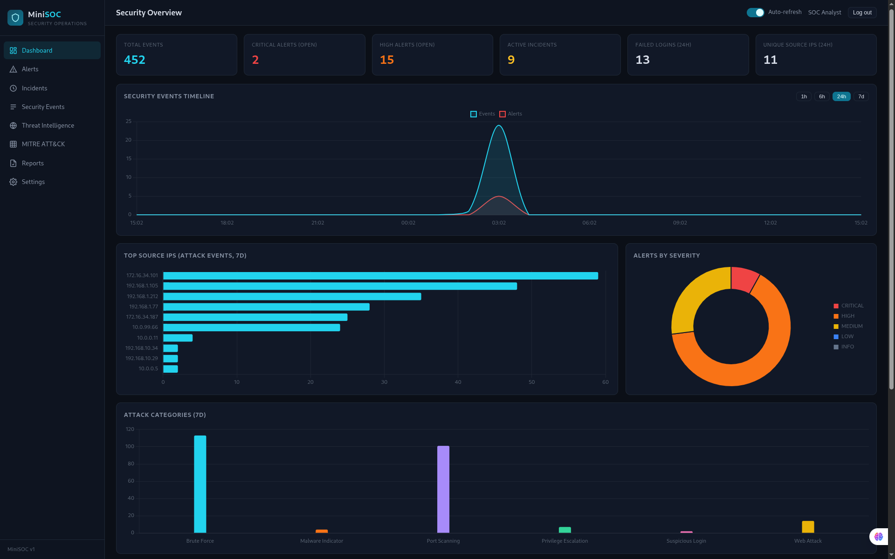
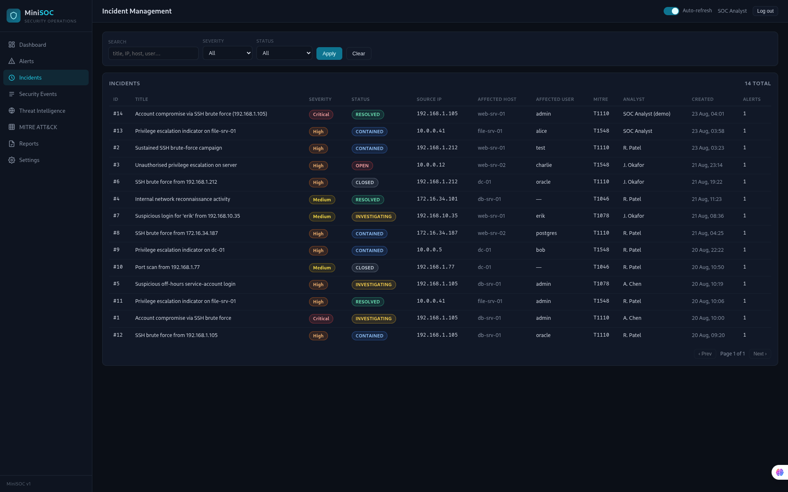
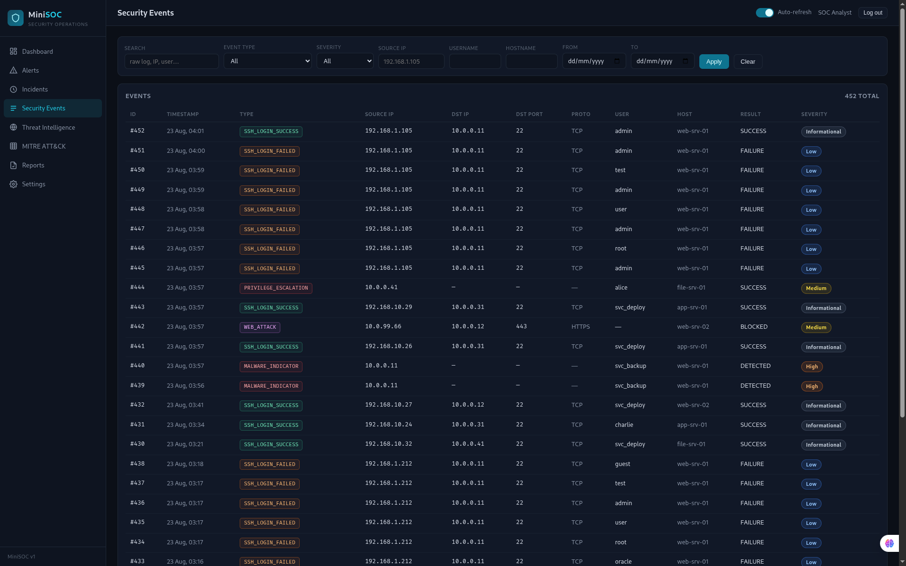

# MiniSOC

MiniSOC is a lightweight Security Operations Center platform designed to
demonstrate security event monitoring, correlation-based detection, alert
investigation, MITRE ATT&CK mapping and incident response workflows. Built
with Python, Flask, SQLAlchemy and SQLite, it implements the full SOC
pipeline end-to-end — events flow through a rule-based detection engine that
raises severity-ranked, ATT&CK-mapped alerts, which analysts triage,
investigate and escalate into tracked incidents from a dark-themed web
console.

## Features

- **SOC dashboard** — KPI cards, event timeline (1h/6h/24h/7d), alerts-by-severity donut, top source IPs, attack categories, recent critical alerts and incidents; all metrics queried live from the database
- **Detection engine** — 5 correlation rules stored in the database (thresholds, time windows, enable/disable at runtime), deduplicated alerting, idempotent re-runs
- **Alert triage & investigation** — search/filter/pagination, full investigation view: evidence (raw log), related events and alerts pivoted by source IP, threat-intel reputation, MITRE ATT&CK context, per-rule recommended actions, analyst notes, status workflow (NEW → INVESTIGATING → RESOLVED / FALSE POSITIVE)
- **Incident response** — one-click escalation from an alert, visual status workflow (OPEN → INVESTIGATING → CONTAINED → RESOLVED → CLOSED), analyst assignment, incident timeline, notes
- **Security events** — 8 event types with color-coded badges, 8 filters, pagination, raw-log detail view
- **Threat intelligence** — local IP-reputation database whose schema mirrors external feeds for future enrichment
- **MITRE ATT&CK** — technique reference with live per-technique detection counts
- **Reports** — live summary and CSV export
- **Security** — session authentication with salted password hashes, CSRF protection on all state-changing requests, parameterised queries, input validation, secrets via environment variables

## Architecture



The ingestion seam is the `SecurityEvent` model: any collector that parses a
log line into that schema feeds the identical detection path — the engine does
not care where events come from.

## Detection Rules

| Rule | Name | Trigger | Severity | MITRE |
|---|---|---|---|---|
| R001 | SSH Brute Force | ≥ 5 failed SSH logins from one source IP within 5 min | High | T1110 |
| R002 | Successful Login After Brute Force | Successful SSH login preceded by ≥ 3 failures from the same IP within 10 min | Critical | T1110 / T1078 |
| R003 | Port Scan Detected | One source IP probes ≥ 10 distinct ports within 3 min | Medium | T1046 |
| R004 | Suspicious Login | Successful login from a bad-reputation IP (escalates to High if malicious) or at unusual hours | Medium/High | T1078 |
| R005 | Privilege Escalation Indicator | Suspicious sudo/root activity (root shell, sudoers edit, repeated sudo failures) | High | T1548 |

Rule metadata (threshold, window, severity, MITRE mapping, enabled flag) lives
in the `detection_rules` table; matching logic in
[app/detection_engine.py](app/detection_engine.py) is looked up by rule code.
The engine processes unprocessed events chronologically, correlates back over
each rule's time window (like a SIEM correlation search), and deduplicates one
alert per rule/source-IP/window.

## MITRE ATT&CK Mapping

Detections map to **T1110** (Brute Force), **T1078** (Valid Accounts),
**T1046** (Network Service Discovery) and **T1548** (Abuse Elevation Control
Mechanism), with T1190/T1105 context for web-attack and malware event
categories. The in-app MITRE page shows live detection counts per technique.
This is a small local reference for the techniques MiniSOC detects, not an
official or complete ATT&CK implementation.

## Technology Stack

- **Backend:** Python 3, Flask 3 (app factory + blueprints), SQLAlchemy 2, SQLite
- **Frontend:** Jinja2, vanilla JavaScript, Chart.js 4 (vendored), custom dark-theme CSS
- **Config:** python-dotenv (`.env`)
- **Testing:** pytest (32 tests)

## Screenshots








## Installation

```bash
git clone https://github.com/<your-username>/MiniSOC.git && cd MiniSOC
python3 -m venv venv
source venv/bin/activate
pip install -r requirements.txt

cp .env.example .env
# set SECRET_KEY (generate with the command below) and the analyst credentials:
python3 -c "import secrets; print(secrets.token_hex(32))"

python scripts/seed_database.py
```

If `DEFAULT_ANALYST_PASSWORD` is left unset (or `CHANGE_ME`), the seed script
generates a random password and prints it once.

## Running Locally

```bash
source venv/bin/activate
python run.py
```

Open **http://127.0.0.1:5000** and sign in with the analyst account configured
in your `.env`.

## Testing

```bash
python -m pytest tests/ -v
```

32 tests cover the models, every detection rule (positive, negative and
dedup/idempotency cases), authentication, CSRF enforcement, input validation,
the alert/incident workflow APIs, filtering/pagination and reports.

## Demo Attack Scenario

The repository includes a controlled event generator used for testing and
reproducibility. `scripts/seed_database.py` builds a 7-day dataset containing
several coherent attack campaigns (brute force, port scanning, web attacks,
privilege escalation — all private-range, fictional IPs), and:

```bash
python scripts/run_demo_scenario.py
```

replays a full compromise live: an SSH brute-force burst from `192.168.1.105`
fires R001 (High), a subsequent successful `admin` login fires R002
(Critical), the alert is escalated to an incident, investigated with notes,
and resolved — the complete analyst workflow, reproducible on demand.

## Current Limitations

Version 1 currently uses a controlled event generator. Real Linux/Windows log
ingestion is planned as the next development stage.

## Roadmap

- **v1** — SOC Dashboard + Detection Engine
- **v1.1** — Linux auth.log ingestion
- **v1.2** — Windows Event Log ingestion
- **v1.3** — Threat intelligence API enrichment
- **v1.4** — Real-time event streaming
- **v2** — Advanced detection / Sigma-style rules / RBAC
